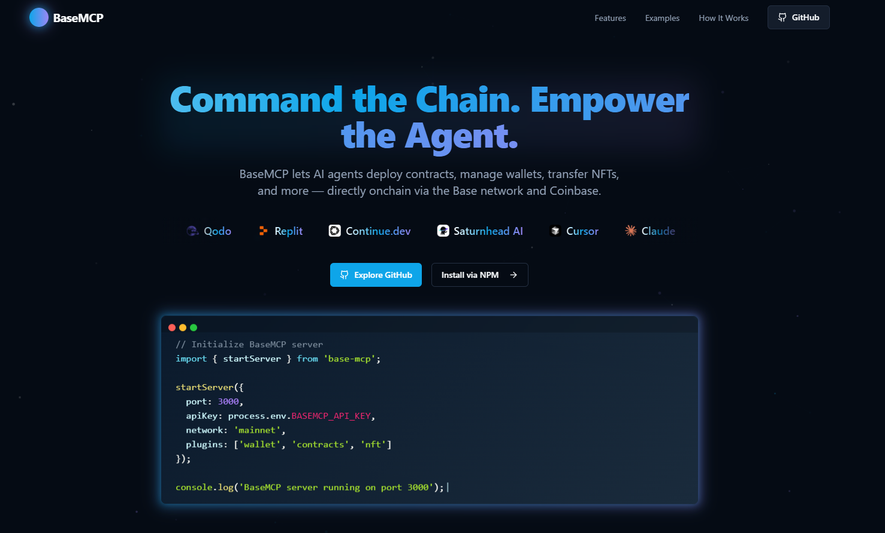

# BaseMCP Landing Page 🔵



A clean, modern landing page showcasing BaseMCP - built as a frontend development passion project.

## About

This is a **frontend showcase project** - a responsive landing page that presents BaseMCP (an AI-blockchain integration tool) through clean design and smooth interactions. Built to demonstrate modern React development skills and UI/UX design capabilities.

## Tech Stack

- **React 18** - Component architecture with hooks
- **TypeScript** - Type-safe development  
- **Tailwind CSS** - Utility-first styling
- **Vite** - Fast build tool and dev server
- **Framer Motion** - Smooth animations
- **shadcn/ui** - Component library

## Features

- **Responsive Design** - Mobile-first, works across all devices
- **Smooth Animations** - Subtle transitions and scroll effects  
- **Clean Typography** - Readable hierarchy and spacing
- **Interactive Elements** - Hover states and micro-interactions
- **Performance Optimized** - Fast loading and smooth scrolling

## Development

```bash
# Install dependencies
npm install

# Start dev server
npm run dev

# Build for production
npm run build
```

## Project Structure

```
src/
├── components/     # React components
├── pages/         # Page components  
├── hooks/         # Custom hooks
└── lib/           # Utilities

public/
├── logos/         # Brand assets
└── banner.png     # Hero image
```

## What It Showcases

- Modern React patterns and TypeScript
- Responsive CSS and Tailwind utilities
- Component composition and reusability  
- Performance optimization techniques
- Clean, accessible UI design

---

*A frontend passion project demonstrating modern web development skills.*